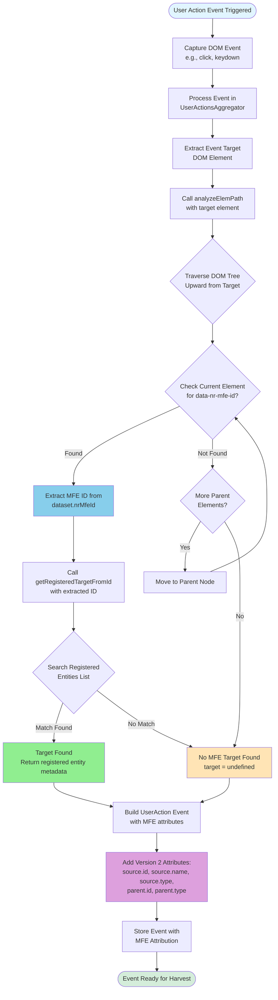
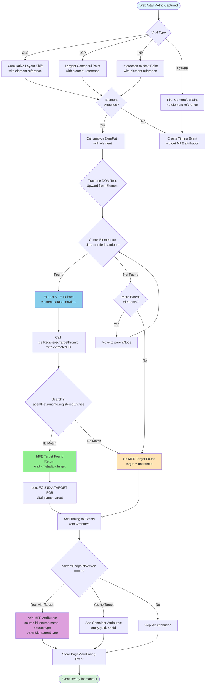

# MFE Automatic Detection Diagrams

## 1. User Actions Detection Flow



## 2. Page View Timings Detection Flow



## 3. JS Errors Detection Flow

```mermaid
flowchart TD
    Start([JS Error Occurs]) --> Capture[Error Captured by<br/>Error Handler]
    Capture --> ComputeStack[Call computeStackTrace<br/>to parse error stack]
    
    ComputeStack --> ExtractFrames[Extract Stack Frames<br/>with URLs]
    ExtractFrames --> InitIterator[Initialize iterator = 0<br/>target = undefined]
    
    InitIterator --> IterateFrames{Iterate Through<br/>Stack Frames}
    IterateFrames --> GetFrameURL[Get URL from<br/>stackInfo.frames[iterator]]
    
    GetFrameURL --> LookupTarget[Call getRegisteredTargetFromFilename<br/>with frame URL]
    LookupTarget --> SearchEntities{Search Registered Entities<br/>for Asset Match}
    
    SearchEntities --> FilterEntities[Filter entities where<br/>entity.metadata.timings.asset exists]
    FilterEntities --> URLMatch{Does asset URL<br/>endsWith frame URL?}
    
    URLMatch -->|Match Found| TargetFound[MFE Target Found<br/>Set target from entity.metadata.target]
    URLMatch -->|No Match| IncrementIterator{More Stack Frames?}
    
    IncrementIterator -->|Yes| IncIterator[iterator++]
    IncIterator --> IterateFrames
    IncrementIterator -->|No| NoTarget[No MFE Target Found<br/>target remains undefined]
    
    TargetFound --> LogTarget[Log: target was found as<br/>target object]
    LogTarget --> BuildError
    NoTarget --> BuildError[Build Error Event with<br/>stackHash, exceptionClass, etc.]
    
    BuildError --> CheckVersion{harvestEndpointVersion === 2?}
    
    CheckVersion -->|Yes with Target| AddMFEAttrs[Add MFE V2 Attributes:<br/>source.id, source.name, source.type<br/>parent.id, parent.type]
    CheckVersion -->|Yes no Target| AddContainerAttrs[Add Container V2 Attributes:<br/>entity.guid, appId]
    CheckVersion -->|No| SkipV2
    
    AddMFEAttrs --> StoreError[Store JS Error Event<br/>in events aggregator]
    AddContainerAttrs --> StoreError
    SkipV2[Skip V2 Attribution] --> StoreError
    
    StoreError --> Note1[Note: Works for lazy loaded MFEs<br/>if parent script URL is in stack]
    Note1 --> End([Error Ready for Harvest])
    
    style Start fill:#e1f5ff
    style End fill:#d4edda
    style TargetFound fill:#90EE90
    style NoTarget fill:#FFE4B5
    style AddMFEAttrs fill:#DDA0DD
    style URLMatch fill:#87CEEB
    style Note1 fill:#FFF3CD
```

## Key Detection Mechanisms Summary

### DOM-Based Detection (User Actions, Page View Timings)
- **What it detects**: Events with real DOM nodes (User Actions, CLS, LCP, INP)
- **How it works**:
  1. Customer decorates MFE root with `data-nr-mfe-id` attribute
  2. Agent traverses DOM tree upward from event target
  3. Searches for `data-nr-mfe-id` on each ancestor element
  4. Compares found ID to registered entities list
  5. If match found, attributes event to that MFE

### Stack Trace-Based Detection (JS Errors)
- **What it detects**: Events with URLs in stack traces (uncaught JS errors)
- **How it works**:
  1. Agent stores MFE script URL during registration (from `entity.metadata.timings.asset`)
  2. When error occurs, traverses stack frames from top to bottom
  3. Compares each frame's URL to registered entities' asset URLs
  4. If match found, attributes error to that MFE
  5. Even works for some lazy loaded scripts (parent script URL in stack)

### Registration Process
Both detection methods rely on a registered entities list populated via the `register()` API:
- Entities stored in `agentRef.runtime.registeredEntities`
- Each entity contains:
  - `metadata.target.id` - The MFE identifier
  - `metadata.target.name` - The MFE name
  - `metadata.target.type` - Usually 'MFE'
  - `metadata.timings.asset` - The script URL (for stack trace matching)

### V2 Harvest Attribution
When `harvestEndpointVersion === 2`, events include:
- **For MFE-attributed events**: `source.id`, `source.name`, `source.type`, `parent.id`, `parent.type`
- **For container agent events**: `entity.guid`, `appId`
