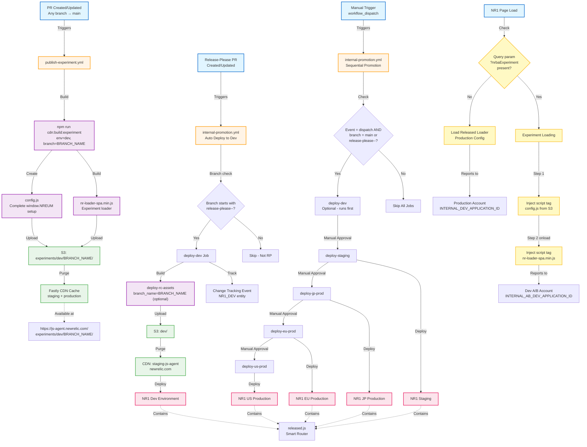

# NR1 Browser Agent Deployment Flow

This diagram illustrates the complete deployment process for the New Relic Browser Agent into NR1 pages, including regular PRs, release-please PRs, experiments, and multi-environment promotions.

## Key Workflows

### 1. PR Experiment Publishing (Automatic)
- **Trigger**: Any PR created or updated against main branch
- **Workflow**: `publish-experiment.yml`
- **Output**: Experiment files at `experiments/dev/<branch-name>/`
  - `config.js` - Complete window.NREUM configuration
  - `nr-loader-spa.min.js` - Browser agent loader
- **Testing**: `https://one.newrelic.com/?nrbaExperiment=<branch-name>`
- **Concurrency**: Cancels previous builds on PR update

### 2. Release-Please Dev Auto-Deploy
- **Trigger**: Release-please PR created or updated
- **Workflow**: `internal-promotion.yml` (auto-triggered on PR)
- **Filter**: Branch name starts with `release-please--`
- **Output**: 
  - Deployed to NR1 dev environment
  - Version suffix: `1.316.0-<branch-name>` (or `1.316.0-dev` if no branch name provided)
  - Change tracking event created
- **Concurrency**: Cancels previous dev deploys for same PR

### 3. Manual Environment Promotion
- **Trigger**: Manual workflow dispatch
- **Workflow**: `internal-promotion.yml`
- **Filter**: Must be on `main` or `release-please--` branch
- **Sequence**: dev → staging → jp-prod → eu-prod → us-prod
- **Approvals**: Manual approval required for staging and beyond
- **Output**: Released loader deployed to each NR1 environment

### 4. Experiment Loading on NR1 Pages
- **Default**: Loads released production loader
- **With Query Param**: `?nrbaExperiment=<branch-name>`
  1. Smart router in `released.js` detects param
  2. Loads `config.js` from `experiments/dev/<branch-name>/`
  3. On config load, loads `nr-loader-spa.min.js`
  4. Agent reports to dev A/B account
- **Fallback**: Any error returns to released loader

## Environments

| Environment | CDN | S3 Bucket Path | Manual Approval | Change Tracking |
|-------------|-----|----------------|-----------------|-----------------|
| Dev | staging-js-agent.newrelic.com | dev/ | No | Yes (auto) |
| Staging | js-agent.newrelic.com | staging/ | Yes | Yes |
| JP Prod | js-agent.newrelic.com | jp-prod/ | Yes | Yes |
| EU Prod | js-agent.newrelic.com | eu-prod/ | Yes | Yes |
| US Prod | js-agent.newrelic.com | prod/ | Yes | Yes |

## Experiment Files

| File | Purpose | Created By | Location |
|------|---------|------------|----------|
| config.js | Complete window.NREUM setup (non-mutative) | publish-experiment.yml | experiments/&lt;env&gt;/&lt;branch&gt;/ |
| nr-loader-spa.min.js | Browser agent loader | publish-experiment.yml | experiments/&lt;env&gt;/&lt;branch&gt;/ |
| released.js | Smart router with experiment detection | internal-promotion action | Injected into NR1 pages |

## Obsolete Workflows

The following workflows/jobs are **no longer used** with the query-param approach:

- ✗ `publish-ab` job (was in publish-experiment.yml) - Random A/B selection replaced by query params
- ✗ `publish-dev.yml` workflow - Replaced by auto-deploy on release-please PRs
- ✗ `build-ab` action - No longer needed with query-param approach
- ✗ `internal-ab` action - No longer needed with query-param approach
